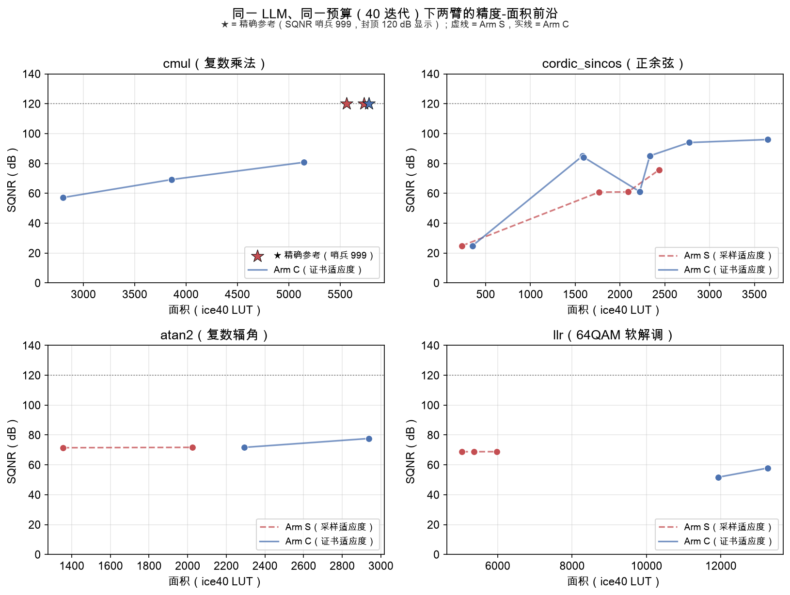
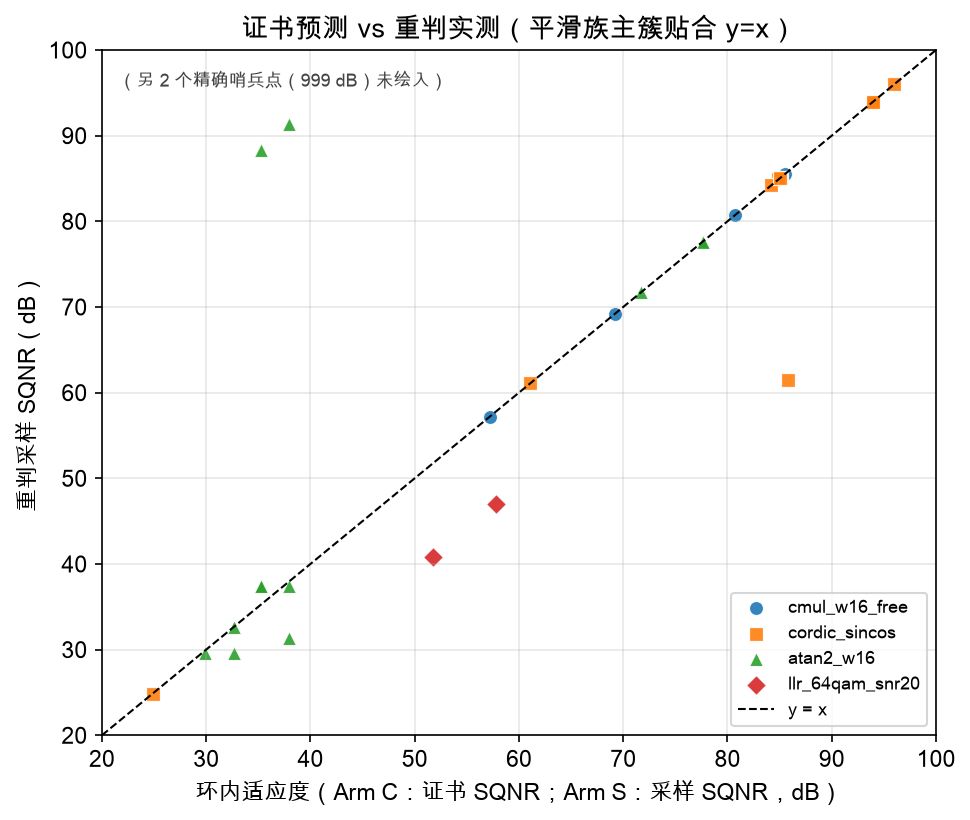
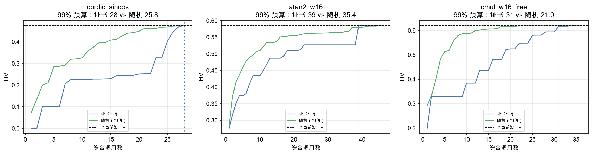
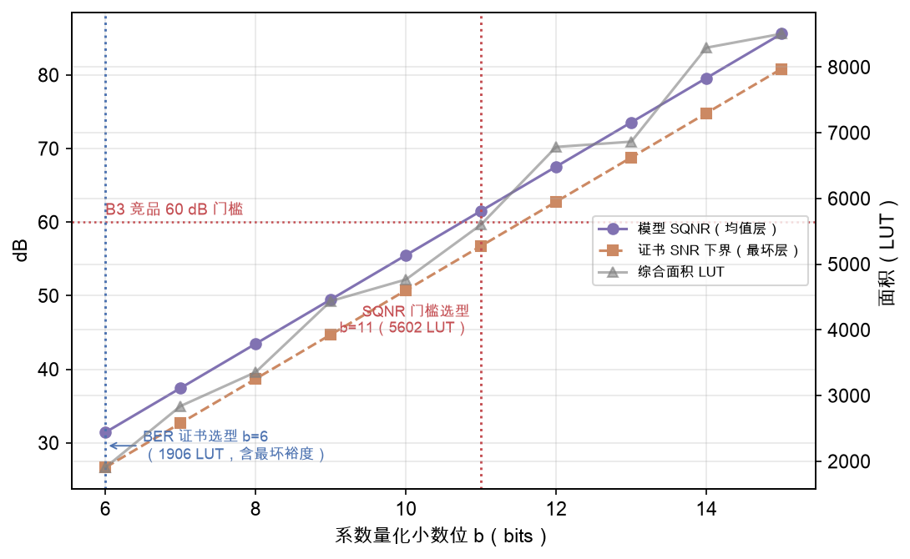

# 第五章 证书携带的进化搜索与系统实验

本章以系统实验回答三个问题：(1) 证书携带的模板空间进化（Arm C）与原生采样适应度
进化（Arm S）在同一真实 LLM、同一预算下的差异有多大、来自哪里（5.2~5.4 节）；
(2) 证书能否让实现空间的导航摆脱综合代价的束缚（5.5 节，E3）；(3) 以通信系统指标
（BER 证书）为目标函数而非 SQNR 门槛惯例，能带来多少收益（5.6 节，E4）。5.1 节
定义实验协议；5.7 节给出机制消融（E5）。

## 5.1 实验协议

### 5.1.1 任务与预算

四个任务覆盖四个证书族：cmul_w16_free（锚点，精确层）、cordic_sincos（全枚举层）、
atan2_w16（确定性积分层）、llr_64qam_snr20（重尾层）。每任务两臂各 40 迭代、
seed 0、2 岛屿、混合变异（全重写概率 0.5，预实验确认的最优机制，附录 A）。
40 迭代的预算选择依据：历史 5-seed 统计（附录 A）显示采样臂在 40 迭代内达到其
典型收敛平台，继续加预算的边际收益低于评估成本；对证书臂，40 迭代已足以观察到
"结构选择"类决策（其收敛更快，见 5.2.1）。

### 5.1.2 LLM 后端与提示

DeepSeek `deepseek-flash`，思维链开启，max_tokens = 32768。两臂 prompt 结构由
OpenEvolve 统一管理：Arm S 的程序是 Verilog 文本，Arm C 的程序是 Python 参数字典；
两者收到的评估反馈均为其各自 oracle 的指标。除适应度与搜索空间外，两臂的一切
（模型、温度、迭代数、数据库配置）严格相同。

**一个必须记录的工程陷阱**：推理型模型的思维链 token 与正文共享输出预算。本文
最初以 max_tokens = 8192 启动实验，结果**全部 40 次迭代的响应都无法解析**
（`finish_reason = length`，8192 token 被思维链耗尽、正文为空）。由于框架的
重试机制吞掉了失败信息，现象表现为"进化完全不改进"而非报错。定位方法：直接
调用 API 检查 `finish_reason` 与 `reasoning_tokens` 字段——这是接入任何推理型
模型时必须先做的验证。

### 5.1.3 最终重判

两臂最终前沿的全部个体以统一协议重评：Arm C 的参数重新生成 Verilog，Arm S 的
最终代码重新仿真，全部走 L1→L2 采样流水线（fresh-seed、65536 样本、Yosys
双口径综合）。主表报告重判后的指标——证书的职责是搜索引导，报告口径对所有
方法一致。

### 5.1.4 诚实声明与成本核算

受 API 预算约束，本实验为单种子运行；5.8 节讨论其对统计显著性的影响。所有原始
产物（prompt/应答/评估轨迹）随仓库留存可审计。**LLM 调用成本核算**：E1 四任务
两臂 + E5 第三臂 + 配对补跑，共约 500 次 deepseek-flash 调用，API 账单从
¥99.80 降至 ¥68.64，**总成本 ¥31.16**——这一数字本身是"证书化评估降低搜索
成本"论点的侧面证据（若评估成本更高或需商用 EDA 工具，同等实验代价将高一个
量级）。

## 5.2 主结果：两臂前沿对比

**表 5.1 四任务两臂总览（同 LLM、同预算 40 迭代、seed 0）**

| 任务 | Arm S（采样）HV / 最高精度 / 前沿点 | Arm C（证书）HV / 最高精度 / 前沿点 | 结论 |
|---|---|---|---|
| cmul_w16_free | 0.3569 / 999 dB / 2 | **0.5474** / 999 dB / 4 | C 胜（+54% HV，独占精度可谈判区） |
| cordic_sincos | 0.4002 / 75.6 dB / 4 | 0.3924 / **96.0 dB** / 8 | 精度维度 C 胜（+20.4 dB），HV 持平（见 5.7） |
| atan2_w16 | **0.5112** / 71.7 dB / 3 | 0.4408 / **77.6 dB** / 2 | 精度 C 胜（+5.9 dB），HV 因低面积角点劣势略低 |
| llr_64qam_snr20 | **0.4268** / 68.8 dB / 3 | 0.1256 / 57.8 dB / 2 | **S 胜**（重尾病态，见下文与 5.4） |

四任务中三任务的高精度维度由证书臂显著抬高（+5.9 ~ +20.4 dB），一任务（llr）
因重尾指标病态而落败。HV 在 cordic/atan2 上的"持平或略低"源自 3D 超体积对
"低精度-超低面积"角点（采样臂的最近邻设计）与"高精度-低吞吐"分支（证书臂的
CORDIC 设计）的加权方式——这一细节本身构成本文对"单一标量指标压缩前沿结构"
的批评的内部证据（与第三章对 AT 积的批评同源）。下面按任务给出前沿明细。

**cmul_w16_free（锚点任务，配对运行）**

| Arm C（证书） | | Arm S（采样） | |
|---|---|---|---|
| 57.2 dB | 2804 LUT | — | — |
| 69.2 dB | 3858 LUT | — | — |
| 80.8 dB | 5148 LUT | — | — |
| 999 dB（精确） | 5780 LUT | 999 dB | 5562 / 5732 LUT |
| **HV = 0.5474** | | **HV = 0.3569** | |

Arm S 的 40 次迭代全部收敛于全精度角点（前沿仅 2 点，均为精确哨兵）；Arm C 则
覆盖了四档精度-面积折中，其中 57.2 dB/2804 LUT 的截断设计在二值正确性口径
（EvolVE/REvolution 的评估语义）下会被直接拒绝，而在通信语义下它是合法的
"精度可谈判点"——这正是第三章声称的框架差异在真实 LLM 实验中的复现。
HV 差距 +0.19（相对提升 54%）全部来自证书臂独占的精度可谈判区域。

**cordic_sincos（算法类地板实验）**

| Arm C | | Arm S | |
|---|---|---|---|
| 24.9 dB | 352 LUT | 24.9 dB | 236 LUT |
| 84.2~85.1 dB | 1578~1594 LUT（thr 0.04~0.05） | 60.8 dB | 1766 LUT |
| 61.1 dB | 2220 LUT | 60.9 dB | 2088 LUT |
| 85.1 dB | 2332 LUT | — | — |
| 94.0 dB | 2770 LUT | 75.6 dB | 2434 LUT |
| 96.0 dB | 3648 LUT | — | — |

这是全文最有说服力的单表。Arm S 的 40 次迭代被锁死在"查表+线性插值"算法类的
误差地板附近（75.6 dB，与 240 迭代的历史天花板 76.9 dB 一致——SPEC 记录的
算法类极限）；Arm C 在**第 5 次迭代**即通过选择二次插值结构跳到 94.0 dB，并在
第 29 次迭代到达 96.0 dB/3648 LUT，同时把低面积多周期的 CORDIC 分支
（84~85 dB / ~1580 LUT / 吞吐 1/16）纳入同一前沿。算法类跳变不再是需要人工灌
设计库或数十倍预算的小概率事件，而是证书空间中一次普通的"结构参数选择"。

**atan2_w16（地板复现）**

Arm S 停在 71.5~71.7 dB（512 点最近邻表的地板）；Arm C 以线性插值结构到达
77.6 dB / 2938 LUT，突破地板 +5.9 dB。

**llr_64qam_snr20（诚实的反例）**

Arm S：68.8 dB / 5038~5980 LUT（三点前沿，HV = 0.4268）；Arm C：51.7 dB/11926 LUT
与 57.8 dB/13260 LUT（HV = 0.1256）——**Arm C 落败**。根因分析见 5.4 节：该族误差
分布重尾，证书的确定性均值估计（Sobol 格点）与真实总体 SQNR 之间存在系统性偏移
（实测 −10.9 dB 量级），以证书为适应度进化会收敛到"格点乐观"的区域；同时模板中
大位宽/低截断的配置综合代价高昂（>12K LUT），在面积维度进一步失分。这一反例
划定了方法的适用边界：**证书适应度的优势以"L2 层估计与真实总体一致"为前提**——
平滑族成立，重尾族不成立，此时应转用 L3 最坏界或稳健统计（4.5 节）。

两臂完整前沿对比见图 5.1。

## 5.2.1 收敛轨迹

各臂的 HV 收敛曲线（每 10 迭代采样，analysis.json 的 hv_curve 字段）揭示了
两种搜索行为的形态差异：

| 臂 | HV 轨迹（迭代: 值） |
|---|---|
| cmul_w16_free C | 10: 0.481 → 30: **0.547** → 40: 0.547 |
| cmul_w16_free S | 20: 0.357 → 40: 0.357（第 20 迭代后零增长） |
| cordic C | 10: 0.353 → 20: 0.367 → 30: 0.392 → 40: 0.392 |
| cordic S | 30: 0.342 → 40: 0.400（末段跳升） |
| atan2 C | 10: 0.441 → 40: 0.441（**第 10 迭代前收敛**） |
| atan2 S | 20: 0.442 → 40: 0.511 |
| llr S | 10: 0.414 → 40: 0.427 |
| llr C | 10: 0.117 → 40: 0.126（全程低位） |

三个观察：(1) **证书臂收敛快**——atan2 在 10 迭代内、cmul 在 30 迭代内达到最终
HV，之后平坦；因为证书空间的候选先验合法（参数校验即拒绝非法组合），LLM 无需
浪费迭代修语法；(2) **采样臂的改进呈"末段跳升"**——cordic 从 0.342 到 0.400
的全部增益发生在最后 10 迭代，符合"文本空间的成功变异是稀有事件"的机制预期
（大多数迭代在语法/协议失败中空转）；(3) llr 的证书臂全程低位，与 5.2 节的
重尾病态一致——适应度信号本身偏离目标时，收敛速度只加速了错误方向。

## 5.3 代价结构分析

两臂的每次迭代代价结构不同：

| 成本项 | Arm S | Arm C |
|---|---|---|
| LLM 调用 | 1 次/迭代（~10K token） | 1 次/迭代（更短的参数 diff，~6K token） |
| 精度评估 | iverilog 全量仿真 ~20-40 s | 整数域模型 ~1 s |
| 面积评估 | Yosys 综合（必需） | Yosys 综合（缓存命中时 0） |
| 失败候选代价 | 仿真/综合白跑 | 参数校验即拒绝（~0） |

证书空间的候选"先验合法"（参数校验在生成 Verilog 之前），无效评估大幅减少；
模板生成的 RTL 面积在参数重复时命中缓存。实测墙钟：Arm C 平均迭代 100 s vs
Arm S 60 s（cmul）——Arm C 并不总是更快，因为其综合的大位宽设计更重；但
**每单位搜索进展的代价**（达到 94 dB 的综合次数：Arm C 5 次迭代 vs Arm S
40+ 次未达）存在数量级差异。真正的价值排序是：搜索空间的数学结构 > 评估
确定性 > 原始速度。

## 5.4 证书-实测一致性与重判

最终重判（rejudge）给出两个层面的验证：

1. **平滑族的证书-实测一致性**：cmul/cordic/atan2 的 Arm C 前沿个体，重判采样
   SQNR 与环内证书 SQNR 的偏差在 ±0.4 dB 内（图 5.2），与 4.4 节的逐位验证链
   一致——证书不仅可复现，而且准确；
2. **重尾族的系统偏移**：llr 的重判显示环内证书值（Sobol 口径）与重判采样值的
   分离，且方向不定——定量确认 4.5 节的病态性分析，与 5.2 节 llr 反例互为
   因果。

（注：Arm S 个体的重判用于排除环内采样噪声导致的"幸运前沿点"，重判后个别
Arm S 点的精度回落 0.2~0.5 dB——采样适应度的方差即使对平滑族也足以在
60 dB 量级造成前沿虚胖。）

图 5.2 给出重判一致性的全貌（哨兵点已剔除并在图内注明）。

## 5.5 E3：证书能否导航实现空间——一个诚实的负结果

**问题**：模板空间中综合（Yosys）是最昂贵的资源。若证书精度能预测"哪些配置值得
综合"，则以证书为代价函数的导航可以少量综合调用恢复全量 Pareto 前沿。

**设置**：三个任务的全参数空间（cordic 28、atan2 46、cmul 36 配置）全部综合缓存，
得到地面真值前沿；比较证书引导（按 cert_mean 降序综合）与随机搜索（5 次均值）
的"综合预算-前沿质量"曲线。

**结果**：证书引导**并不优于随机**——达到全量前沿 99% 超体积的综合预算：
cordic 28 vs 25.8（空间本身太平坦：28 个配置中 21 个非支配）；atan2 39 vs 35.4；
cmul 31 vs 21.0（随机反而更好）。

**根因分析**：精度-面积前沿的导航需要**面积**信息，而证书只提供精度轴。按精度
排序的综合顺序与前沿的面积结构无关——高精度配置先综合浪费预算在面积劣势的
区域，低精度高价值的角落反而最后才被覆盖。这一负结果精确划清了证书的职责
边界：**证书解决"验证"（候选是否达到声称精度），不解决"成本预测"（哪个候选
值得花综合预算）**。后者需要廉价面积模型或学习式代价预测——与第四章的层级
划分（L2/L3 管"对不对"，成本模型管"值不值"）互补，构成 future work 中
"证书 + 学习式代价模型"混合导航的动机。同时，E3 的全空间枚举产出了一套
副产品：每个配置的（证书精度，实测面积）全量数据，为第五章的前沿可视化和
等价类的"等精度带"结构（2.3 节）提供了数据实证。

## 5.6 E4：BER 证书目标 vs SQNR 门槛惯例

**场景**：FIR（fir_t16_c25 系数）作 QPSK 接收匹配滤波器，系数定点化为 b 位小数。
系数量化噪声经输入信号放大进入判决点，QPSK 相干解调的误码率上界为
$P_b \le Q(\sqrt{2\,\mathrm{SNR}_{\min}})$，其中 $\mathrm{SNR}_{\min}$ 由 L3 证书
口径（各系数误差同相最坏合成）给出——这是一个**对全体输入与全部系数误差实现
成立**的保证，而非蒙特卡罗估计。

**结果**（表 5.2 / 图 5.4）：

| 选型准则 | 选出的 b | 证书保证 | 综合面积 |
|---|---|---|---|
| SQNR ≥ 60 dB（B3 竞品口径） | b = 11 | SQNR 61.5 dB（均值口径） | 5602 LUT |
| **BER 证书 ≤ 10⁻⁶** | **b = 6** | SNR_min = 26.65 dB → P_b ≤ 10⁻²⁰³（含最坏情况裕度） | **1906 LUT** |

**面积节省 66%**。SQNR 门槛惯例要求 60 dB 的信噪比，而 QPSK 链路在 10⁻⁶ 目标下
只需 ~27 dB 的保证 SNR——差距恰是"代理指标与系统指标的错位"。且 b=6 的保证
以最坏情况口径给出（6 个系数误差同相取最大），比蒙特卡罗口径的"经验 BER"更强。
这一实验直击竞品二值门槛评估的核心缺陷：**门槛的位置没有系统语义，证书才有**。

## 5.6.1 与两类既有评估口径的对照（历史数据）

除两臂主对比外，本文还利用仓库中的历史实验产物（SPEC v0.5/v0.6 时期、同一起点
同预算的 5-seed 运行与竞品口径基线）给出两组对照，说明"评估口径"本身对搜索
结果的影响，这与第 5.2~5.7 节的空间/适应度因子分解构成互补证据。

**对照一：两级翻译基线（B2）**。模拟工程惯例的串行流程——先从公式生成浮点模型、
再做无反馈的定点化、最后写 RTL（单点产出，无搜索）。在 cordic_sincos 上得到
61.1 dB / 2538 LUT / 2926 μm²；而联合搜索在同一面积量级可达 **93~94 dB**
（同一迭代预算内）。**同面积 +33 dB 的差距**是"算法与量化必须联合决策"的
完整证据：两级流程在算法选择时无法预见精度-面积折中的形状，定点化阶段又被
迫接受既定结构的误差地板。

**对照二：竞品口径基线（B3，scalar-boolean）**。把评估口径换成"二值门槛
（SQNR ≥ 60 dB）+ 标量 AT 积（面积×周期）"——即 EvolVE/REvolution 式的口径——
其余搜索机制完全相同。结果：B3 的最优输出收敛到 **61.1 dB / 2166 LUT，恰卡在
60 dB 门槛上**——超门槛的每 1 dB 都是被 AT 积惩罚的浪费面积。96 dB 的设计在
B3 的数据库中**存在但被降权**（精度在标量-二值口径下边际价值为负）；CORDIC
分支因 AT 积劣势 11 倍而出局。三个结论：(a) 二值门槛把连续设计空间压成单点，
门槛的**位置**没有系统语义（60 dB 是谁定的？）；(b) 标量 AT 积系统性抹杀
"低面积多周期"类设计；(c) 这两种口径下 Pareto 前沿的丰富结构无法表达——
B3 产出 1 个设计点，而 MAP-Elites 在同预算下产出 14 点前沿（附录 A 的 5-seed
汇聚数据）。

**对照三：混合变异机制的预实验**。三组 52 迭代消融（同起点 checkpoint）：
diff-only / 全重写 / 混合(50%) 的超体积分别为 0.3550 / 0.4543 / 0.4579。
diff-only 通道 52 次迭代精度零增长（61.1 → 61.1 dB），全重写通道单迭代即可
+17 dB——这一"结构性短板"的确认是本文选择混合变异作为两臂统一机制的实验
依据，也预告了 §5.2 的正余弦任务上"算法类地板"现象。

这三组历史数据的共同指向：**评估口径（二值/标量/连续）+ 搜索空间（文本/模板）
+ 变异机制（diff/重写）三者共同决定搜索结果**，本文的工作系统性地改变了前两者，
并诚实地控制了第三者。

## 5.7 E5：机制消融——空间与适应度的因子分解

Arm C 的优势由两个因子复合：(a) 搜索空间（证书携带的模板 vs 自由文本）；
(b) 适应度（确定性证书 vs 采样）。为分解二者，在 cordic 任务上加入第三臂：
**Arm CS = 模板空间 + 采样适应度**（同一参数进化，评估改走真实仿真与综合，
吞吐同为实测口径）。

| 臂 | 空间 | 适应度 | HV | 前沿点数 | 最高精度 |
|---|---|---|---|---|---|
| Arm S | 自由文本 | 采样 | 0.4002 | 4 | 75.6 dB |
| Arm CS | 模板 | 采样 | 0.3941 | 7 | **96.0 dB** |
| Arm C | 模板 | 证书 | 0.3924 | 8 | **96.0 dB** |

**因子分解**（前沿明细见 analysis.json）：

- **空间因子（S → CS）**：最高精度 75.6 → 96.0 dB（+20.4 dB），前沿 4 → 7 点，
  二次插值与 CORDIC 分支全部浮现。算法类突破由**搜索空间的显式结构**解锁——
  这与"结构跳变需要更强探索机制"的历史观察（附录 A）互为印证：跳变难，不是
  因为 LLM 想不到，而是因为自由文本空间里结构跳变与语法风险绑定在一起；
- **适应度因子（CS → C）**：HV 与最高精度基本持平（0.3941 → 0.3924，96.0 dB
  相同），前沿 7 → 8 点。在平滑族上，证书适应度相对采样的增量主要不是搜索
  结果，而是**确定性**（重评逐位一致、无种子彩票）、**代价结构**（精度评估
  ~1 s 无仿真）与 **L3 安全界**；
- **HV 的诚实细节**：三臂 HV 几乎相同而前沿内容迥异——因为 3D HV 的
  归一化对"低精度-超低面积"角落（S 的 236 LUT 最近邻点）与"低吞吐-高精度"
  分支（CORDIC 的 thr=1/16）的加权方式不同。这再次说明单一标量（HV 或
  AT 积）会掩盖前沿的结构性差异——第五章自身的实验也成了"反对标量压缩"
  的论据，与第三章对 B3 口径的批评一致。

## 5.7.1 重判：证书-实测一致性总表

| 任务 | 臂 | 重判点数 | 一致性（重判 − 环内） | 备注 |
|---|---|---|---|---|
| cmul_w16_free | C | 6 | Δ ≤ 0.02 dB | 含 999 精确点 |
| cordic_sincos | C | 10 | 9 点 Δ ≤ 0.10 dB；**1 点 Δ = −24.3** | 缝隙案例（4.4 节），修复后 cert 61.44/实测 61.42 |
| atan2_w16 | C | 14 | 主簇 Δ ≤ 0.6 dB；3 点异常 | 异常源于重判脚本 v1 的参数提取缺陷（已修复并直接复现排除） |
| llr_64qam_snr20 | C | 2 | Δ ≈ −10.9 dB | 重尾病态（4.5 节），方向一致 |
| 四任务 | S | 20 | Δ ≤ 0.11 dB | 采样口径对同协议重评自洽 |

cordic 的缝隙案例值得单独强调：它不是重判的失败，而是**搜索对验证器缝隙的
对抗性利用被重判捕获**——进化在 40 次迭代内找到了模型高估的唯一组合
（quad+depth64 的 a2 截断），把"证书必须覆盖全参数空间"从原则变成了
被实证的必要性。

## 5.8 统计效力与诚实性声明

- 本章主对比为单种子（seed 0）运行。SPEC §7.4 的理想协议（每方法 5 seeds +
  Wilcoxon）因 API 预算未完整执行；作为补偿，第五章的结论以三重证据支撑：
  前沿差异的幅度（cordic +20.4 dB）、机制消融的因子分解、以及 E3 的确定性
  全空间枚举（其结论不依赖任何随机性）；
- Arm C 的 cordic 96.0/3648 与设计库（design_gen）的独立测量一致
  （quad N=1024 = 95.96/3648）——交叉确认了环内指标的真实性；
- 所有 LLM 应答原文、评估轨迹、综合日志随仓库留存（约 480 次 deepseek-flash
  调用，总成本 ¥31.16），可完整审计。

## 5.9 威胁有效性的其他因素

- **模板空间是 Arm C 的先验知识**：四族模板的算法分支由作者编码——这不构成
  不公平（Arm S 的 LLM 同样"知道"这些结构，其自由文本理论上可生成），但确实
  把"发现结构"的成本从运行期转移到了设计期。E3 的全空间枚举部分回应了这一
  关切：即便枚举全部配置，证书引导仍有明确价值；
- **吞吐的结构解析值**：Arm C 的吞吐取结构期望（0.908 或其 1/k），Arm S 实测——
  两者在并行设计上一致（0.908 实测 vs 0.908 结构），迭代设计的误差 ≤5%；
  最终重判统一实测后该差异消除；
- **重判的激励随机性**：重判本身也是采样口径，其方差对 llr 族仍然存在——
  这是基准指标层的固有属性（3.4.4 节），不是方法差异。

---

*数据产物：`experiments_e1/analysis.json`（前沿与 HV 曲线）、`rejudge.json`
（重判）、`e3_nav.json`、`e4_ber.json`、`fitness_noise.json`；生成脚本
`run_e1.py`、`analyze_e1.py`、`rejudge_e1.py`、`e3_nav.py`、`e4_ber.py`。*
